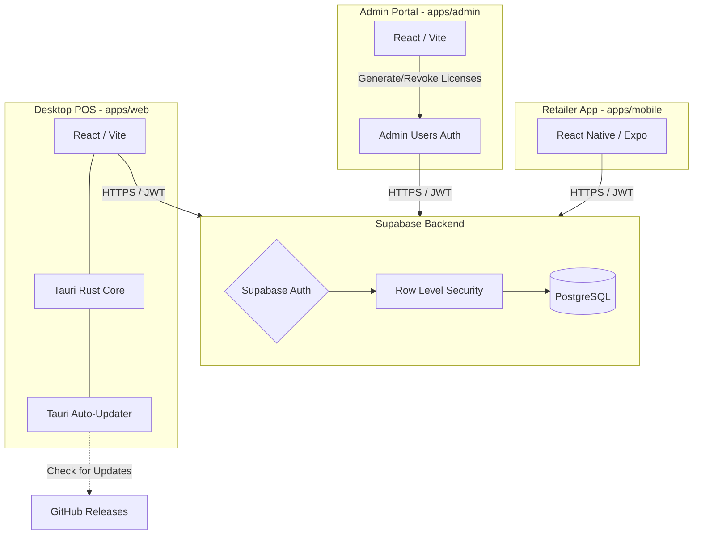

# System Architecture

The CYBSOC Point of Sale (POS) system is a multi-platform Software-as-a-Service (SaaS) ecosystem. It utilizes a centralized Supabase backend to manage data securely while distributing clients across Desktop (Tauri), Mobile (Expo), and Web (React).

## High-Level Architecture Diagram

## Platform Breakdown

### 1. Supabase Backend
- **Database**: PostgreSQL handles all relational data (Users, Licenses, Sales, Products).
- **Authentication**: JWT-based stateless authentication using Supabase Auth.
- **Security**: The backend is secured with **Row Level Security (RLS)**. Clients never use master/service role keys. All database queries are filtered mathematically at the database engine level based on the `auth.uid()` of the requesting user.

### 2. Admin Portal (`apps/admin`)
- **Tech Stack**: React, Vite, TailwindCSS.
- **Purpose**: The internal dashboard for CYBSOC administrators to generate subscription license keys, suspend users, and monitor active SaaS clients.
- **Hosting**: Deployed as a static SPA on GitHub Pages.

### 3. Desktop POS (`apps/web`)
- **Tech Stack**: React, Vite, Tauri (Rust), TailwindCSS.
- **Purpose**: The primary workstation interface for retail cashiers. It is built natively for Windows (`.exe` / `.msi`) ensuring high performance and hardware compatibility.
- **Auto-Updates**: Features a built-in cryptographic updater. When a new version is pushed to GitHub, the POS app prompts the cashier, downloads the patch in the background, verifies the digital signature, and restarts.

### 4. Retailer App (`apps/mobile`)
- **Tech Stack**: React Native, Expo, TailwindCSS (NativeWind).
- **Purpose**: A mobile companion application for retailers.
- **Distribution**: Compiled as a Universal APK via Expo Application Services (EAS) for direct sideloading.
