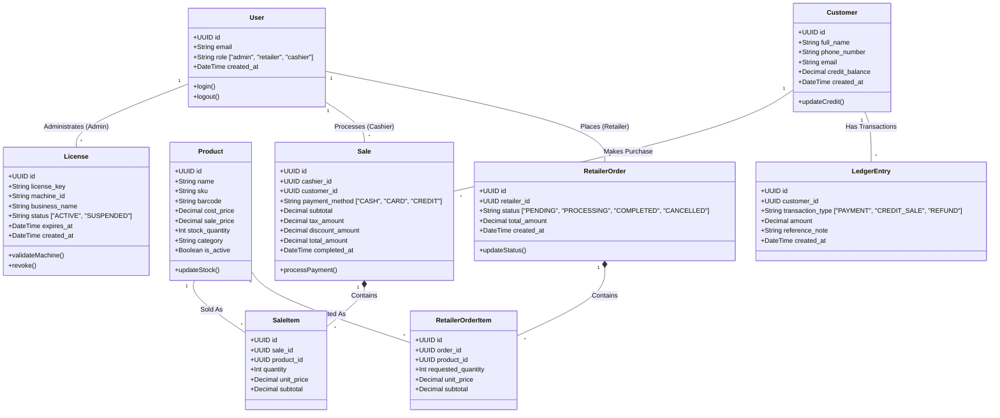

# 🗄️ System Class Diagrams (Overall Project)

The CYBSOC POS ecosystem relies on a highly scalable, multi-tenant relational database schema hosted on Supabase. Below is the comprehensive Entity-Relationship (ER) / Class Diagram defining the data structures across the Admin, Desktop POS, and Mobile Retailer applications.

### Explanation of Sub-Systems

1. **Security & Licensing (Admin Portal)**
   - The `User` table leverages Supabase Auth. Role-Based Access Control (RBAC) and Row Level Security (RLS) policies ensure Cashiers cannot access Admin views, and Retailers can only see their own orders.
   - The `License` table acts as a cryptographic lock. The Desktop POS hardware (`machine_id`) is permanently bound to a `license_key` upon first boot.

2. **Point of Sale & Customers (Desktop App)**
   - When a cashier rings up a customer, a `Sale` is generated containing multiple `SaleItem`s (linked directly to the `Product` table).
   - If a customer buys on credit, the `Customer` table's `credit_balance` is updated, and a historical `LedgerEntry` is recorded for auditing.

3. **Wholesale Ordering (Mobile App)**
   - Retailers use the mobile app to browse the central `Product` inventory and place `RetailerOrder`s. These orders appear instantly on the Desktop POS dashboard for fulfillment.
