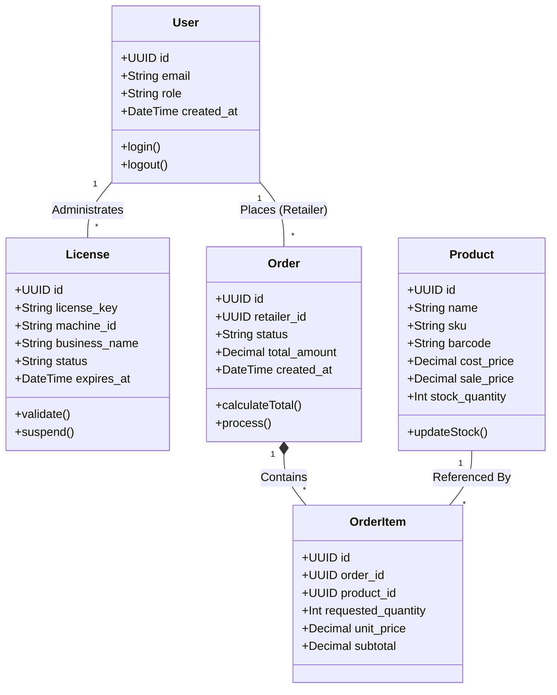

# System Class Diagrams

The CYBSOC POS ecosystem relies on a robust relational database schema hosted on Supabase. Below is the Entity-Relationship (ER) / Class Diagram defining the core data structures and their associations.

### Explanation of Entities
1. **User**: Represents either a CYBSOC Administrator, a Retailer, or a Cashier. Row Level Security (RLS) policies use the `role` and `id` to restrict data access.
2. **License**: Bound to a specific Windows `machine_id`. Validated by the Desktop POS at startup.
3. **Product**: The master inventory table containing pricing and barcodes used by the Desktop barcode scanner and Mobile ordering app.
4. **Order & OrderItem**: Tracks wholesale supply requests from Retailers to the central warehouse.
