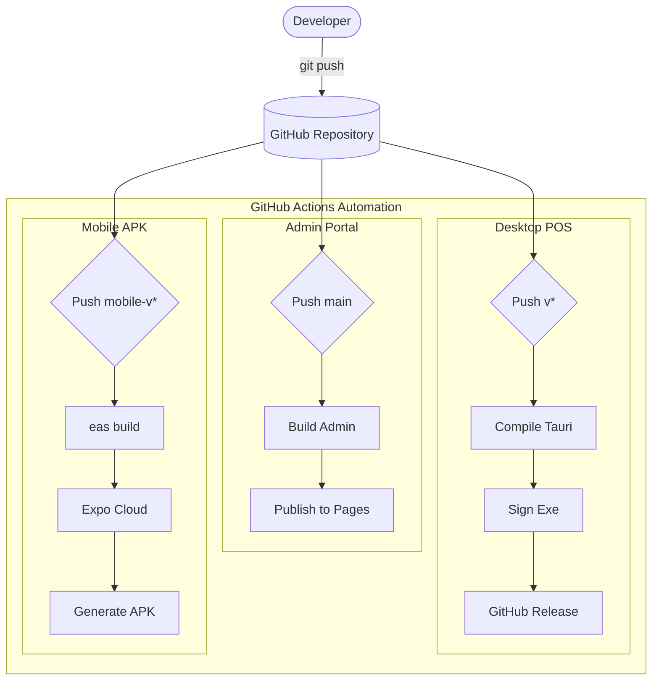
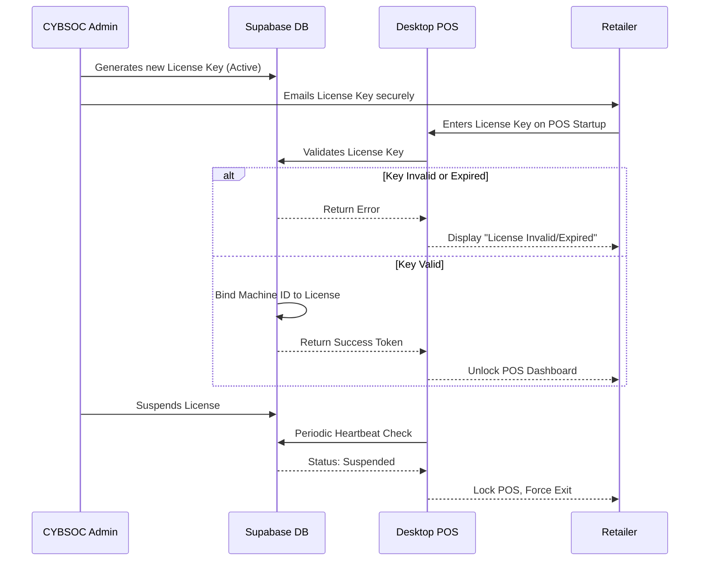

# CI/CD and Auth Workflows

The CYBSOC POS system heavily relies on automation and secure workflows. This document illustrates the critical paths for Deployment and License Authentication.

## Automated Deployment Pipelines (CI/CD)

All deployments are fully automated using GitHub Actions. Developers never need to manually compile or upload binaries.

## License Authentication Workflow

Because this is a SaaS product, clients must activate their machines using a valid CYBSOC license key before the POS system unlocks.

